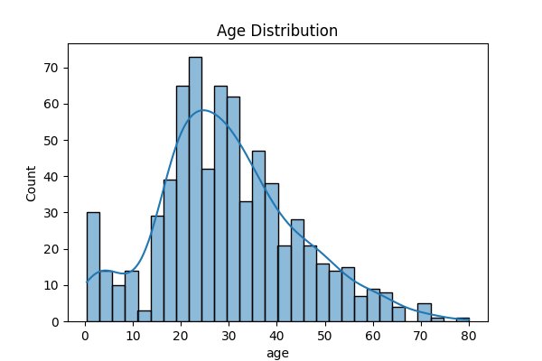
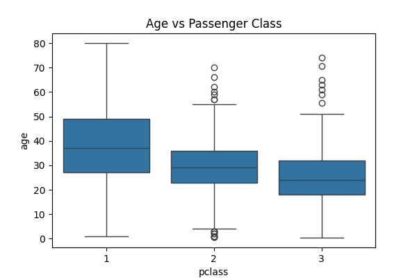
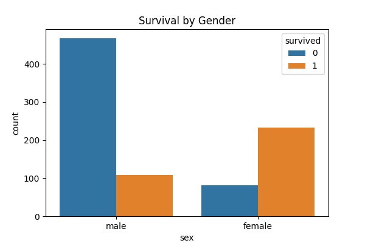
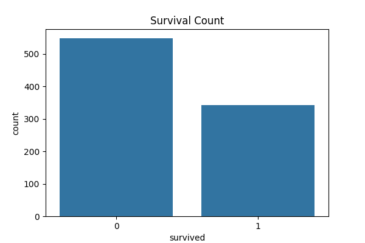

# 📊 Exploratory Data Analysis (EDA)  

A deep dive into dataset exploration using **Python, Pandas, Matplotlib, and Seaborn**.  
This task focuses on uncovering hidden patterns, correlations, and insights to better understand the dataset before applying machine learning models.  

---

## ⚙️ Tech Stack  
- **Language:** Python 3.10+  
- **Libraries:** Pandas, NumPy, Matplotlib, Seaborn  
- **Platform:** VS Code / Jupyter  

---

## 🏗️ Project Structure  
```
📂 EDA-Task
┣ 📜 task2\_eda.py
┣ 🖼️ heatmap.png
┣ 🖼️ distribution.png
┣ 🖼️ pairplot.png
┗ 📜 README\_task2.md

```

---

## 🚀 Workflow  

1. **Load Dataset** → Import CSV/Excel dataset into Pandas.  
2. **Clean Data** → Handle null values, duplicates, and data types.  
3. **Descriptive Stats** → Mean, median, mode, and correlations.  
4. **Visualize** →  
   - Distribution plots  
   - Correlation heatmap  
   - Pair plots  
   - Boxplots / Histograms  
5. **Extract Insights** → Identify trends, relationships, and anomalies.  

---

## 📊 Results  

### ✅ Key Insights  
- Identified missing values and handled them.  
- Found strong correlations among important features.  
- Visualized feature distributions to detect skewness/outliers.  

### 🔍 Visualizations  

| Visualization | Description |
|---------------|-------------|
|  | Distribution of passenger ages |
|  | Relationship between age, class, and survival |
|  | Gender-wise survival comparison |
|  | Overall survival counts |

---