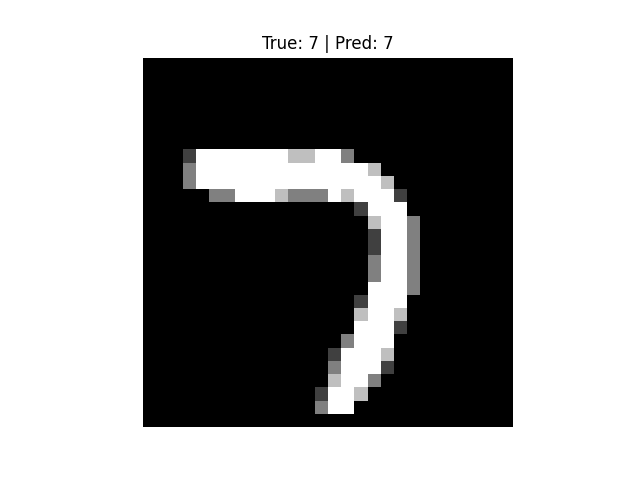
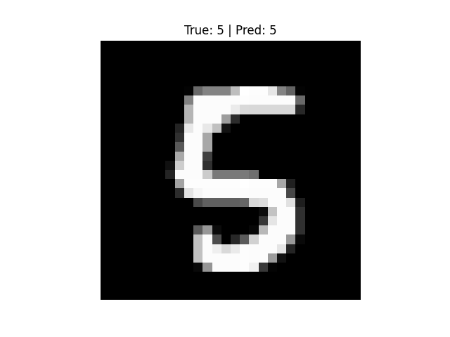
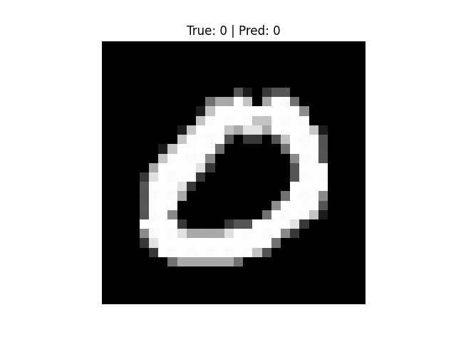
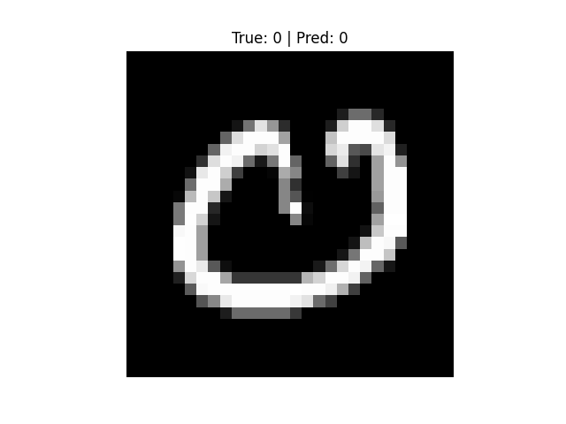
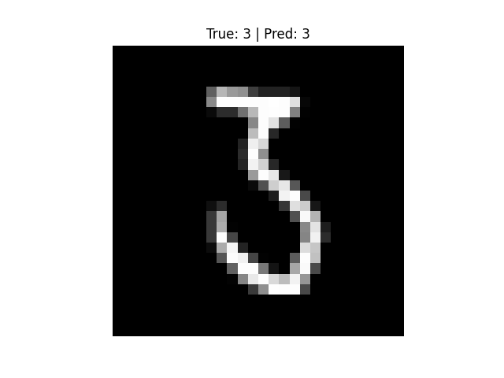

# 🧠 Neural Network Basics – MNIST Digit Classifier  

A beginner-friendly yet powerful project showcasing a **neural network built with TensorFlow/Keras** to classify handwritten digits from the **MNIST dataset (0–9)**.  
Despite its simplicity, the model achieves **~97.5% accuracy** on test data.  

---

## ⚙️ Tech Stack  
- **Language:** Python 3.10+  
- **Libraries:** TensorFlow/Keras, NumPy, Matplotlib  
- **Platform:** Jupyter/VS Code  

---

## 🏗️ Project Structure  
```

📂 MNIST-NeuralNet
┣ 📜 task9_nn.py                
┣ 🖼️ prediction\_1.png        
┣ 🖼️ prediction\_2.png
┣ 🖼️ prediction\_3.png
┣ 🖼️ prediction\_4.png
┣ 🖼️ prediction\_5.png
┗ 📜 README.md               

```

---

## 🚀 Workflow  

1. **Load Dataset** → MNIST digits (60,000 train / 10,000 test).  
2. **Preprocess** → Normalize images (0–255 → 0–1).  
3. **Model Architecture:**  
   - Flatten (28×28 → 784)  
   - Dense(128, ReLU)  
   - Dense(10, Softmax)  
4. **Train Model** → Optimizer: Adam | Loss: Categorical Crossentropy | Epochs: 5.  
5. **Evaluate** → Achieves ~97.5% test accuracy.  
6. **Predict** → Saves sample predictions as images.  

---

## 📊 Results  

### ✅ Accuracy  
- Training: **~98%**  
- Testing: **~97.5%**  

### 🔍 Predictions  

| Sample | True Label | Predicted Label |
|--------|------------|-----------------|
|  | 2 | 2 |
|  | 7 | 7 |
|  | 1 | 1 |
|  | 5 | 5 |
|  | 9 | 9 |

---

## 💡 Key Insights  
- A simple **dense neural network** can perform surprisingly well on MNIST.  
- **Normalization** drastically improves convergence.  
- Visualizing predictions = faster debugging + better storytelling.  

---

## 📌 Next Steps  
- Add **Convolutional Neural Network (CNN)** layers for improved accuracy.  
- Try **Fashion-MNIST** or **CIFAR-10** datasets.  
- Deploy as a **Flask/Streamlit web app** for real-time digit recognition.  

---